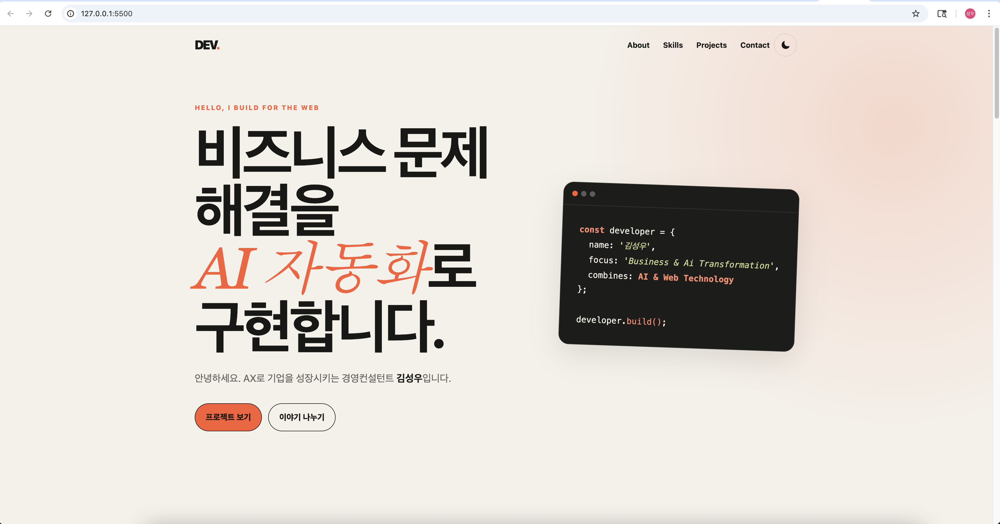
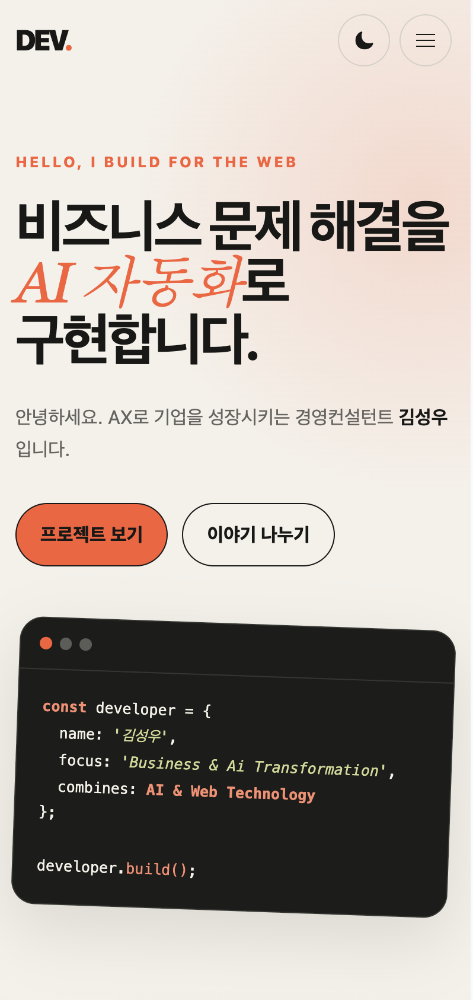
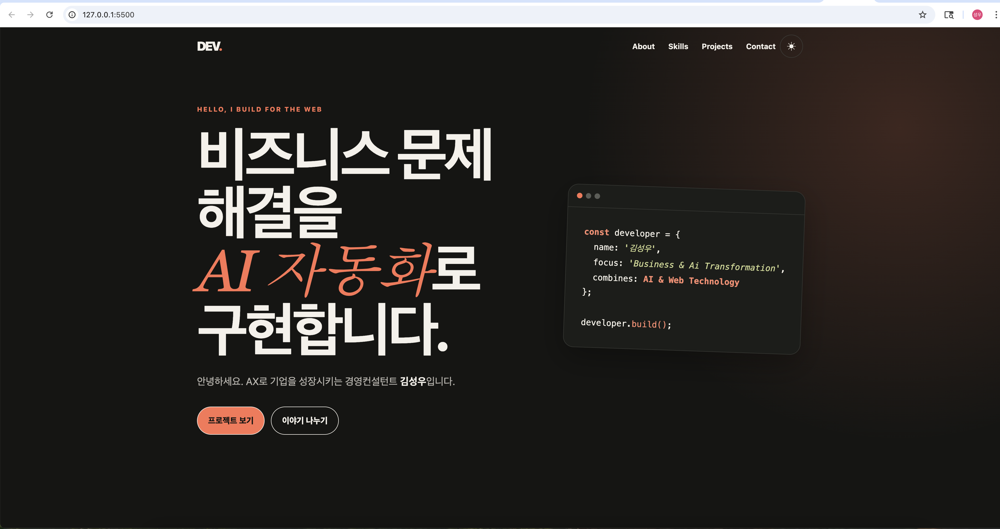

# 반응형 포트폴리오 웹사이트

순수 HTML, CSS, JavaScript로 제작한 개인 포트폴리오 웹사이트입니다.

외부 프레임워크 없이 DOM 조작, 이벤트 처리, 상태 관리, 비동기 API 호출을 구현했습니다. GitHub API를 통해 본인의 공개 저장소를 동적으로 표시하고, Web3Forms를 이용해 문의 내용을 실제 이메일로 전송합니다.

## 배포 주소

- 웹사이트: https://investkorea7.github.io/portfolio-submission/
- GitHub 저장소: https://github.com/investkorea7/portfolio-submission

## 주요 기능

- 모바일 퍼스트 반응형 레이아웃
- 768px, 1024px 반응형 브레이크포인트
- 모바일 햄버거 메뉴
- 각 섹션으로 이동하는 부드러운 스크롤
- 다크 모드 전환
- 다크 모드 설정을 `localStorage`에 저장
- 시스템 다크 모드 설정 감지
- 스크롤 위치에 따른 내비게이션 스타일 변경
- 페이지 맨 위로 이동하는 스크롤 탑 버튼
- `IntersectionObserver` 기반 스크롤 애니메이션
- GitHub API를 이용한 공개 저장소 표시
- 프로젝트 언어별 필터링
- GitHub API 로딩·성공·오류·빈 상태 처리
- 이름·이메일·메시지 입력값 검증
- Web3Forms를 이용한 실제 문의 메일 전송

## 페이지 구성

- Hero: 인사말과 프로젝트·문의 CTA 버튼
- About: 자기소개와 프로필 이미지
- Skills: 사용 기술과 역량
- Projects: GitHub 공개 저장소 목록
- Contact: 문의 작성 및 이메일 전송
- Footer: 저작권, GitHub 및 이메일 링크

## 사용 기술

- HTML5
- CSS3
  - Custom Properties
  - Flexbox
  - Grid
  - Media Queries
  - Transition
- JavaScript ES6+
  - DOM API
  - Event Listener
  - Fetch API
  - Async/Await
  - Template Literals
  - Destructuring
  - map, filter, forEach
- GitHub REST API
- GitHub Pages
- Web3Forms

## 프로젝트 구조

```text
portfolio-submission/
├── index.html
├── README.md
├── css/
│   └── style.css
├── images/
│   ├── profile-photo.png
│   ├── screenshot-desktop.png
│   ├── screenshot-mobile.png
│   └── screenshot-dark.png
└── js/
    └── main.js
```

## 인터랙션 구현

### 햄버거 메뉴

모바일 화면에서 햄버거 버튼을 누르면 메뉴 상태가 변경되고, `active` 클래스에 따라 메뉴가 열리거나 닫힙니다. 메뉴 링크를 선택하면 모바일 메뉴가 자동으로 닫힙니다.

### 다크 모드

다크 모드 버튼을 누르면 테마 상태가 변경됩니다. 선택한 테마는 `localStorage`에 저장되어 새로고침 후에도 유지됩니다.

저장된 테마가 없으면 `prefers-color-scheme`을 통해 사용자의 시스템 테마를 확인합니다.

### 스크롤 기능

- 60px 이상 스크롤하면 헤더 배경이 변경됩니다.
- 300px 이상 스크롤하면 맨 위로 버튼이 나타납니다.
- 내비게이션 링크를 누르면 해당 섹션으로 부드럽게 이동합니다.
- `IntersectionObserver`의 `threshold: 0.2`를 이용해 요소 등장 애니메이션을 구현했습니다.

### GitHub 프로젝트

`fetch`와 `async/await`를 사용해 다음 GitHub API를 호출합니다.

```text
https://api.github.com/users/investkorea7/repos
```

API 요청 상태에 따라 다음 화면을 표시합니다.

- 로딩: 스피너 표시
- 성공: 프로젝트 카드 목록 표시
- 오류: 오류 메시지와 재시도 버튼 표시
- 빈 상태: 표시할 프로젝트가 없다는 메시지 표시

GitHub API는 인증 없이 호출하므로 시간당 요청 횟수 제한이 있을 수 있습니다.

### 문의 폼

문의 폼에서 다음 내용을 검사합니다.

- 이름 필수 입력
- 이메일 필수 입력 및 형식 검사
- 메시지 필수 입력
- 입력 오류 메시지 표시
- 중복 전송 방지를 위한 전송 버튼 비활성화
- 전송 성공 또는 실패 결과 표시

유효성 검사를 통과한 문의는 Web3Forms API를 통해 실제 이메일로 전송됩니다.

## 상태와 화면 업데이트 흐름

1. 테마 버튼 클릭 → 테마 상태 변경 → 전체 화면 스타일 변경
2. GitHub API 요청 → 로딩·성공·오류 상태 변경 → Projects 화면 변경
3. 폼 입력 → 오류 상태 변경 → 입력 필드 오류 메시지 변경
4. 프로젝트 필터 클릭 → 선택 언어 상태 변경 → 프로젝트 목록 변경

## 실행 방법

1. 저장소를 내려받거나 복제합니다.

```bash
git clone https://github.com/investkorea7/portfolio-submission.git
```

2. VS Code에서 `portfolio-submission` 폴더를 엽니다.
3. Live Server 확장 프로그램을 설치합니다.
4. `index.html`을 엽니다.
5. VS Code 오른쪽 아래의 `Go Live`를 누릅니다.
6. 브라우저에서 표시되는 로컬 주소로 접속합니다.

## 스크린샷

### 데스크톱 화면



### 모바일 화면



### 다크 모드 화면



## 제작자

김성우

- GitHub: https://github.com/investkorea7
- Portfolio: https://investkorea7.github.io/portfolio-submission/